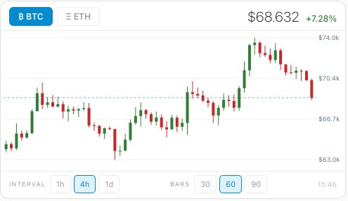

# Crypto Card for Home Assistant

[](https://github.com/hacs/integration)
[](https://github.com/captain-nemo/ha-crypto-card/releases)
[](LICENSE)

A custom Lovelace card for Home Assistant that displays real-time candlestick charts for any Binance-listed coin. No API key or account required.



---

## What's New in v2.0.0 🎉

### ✨ Visual Card Editor
No more hand-editing YAML — configure the card directly from the Home Assistant UI with a point-and-click editor.

### 🪙 Multi-Coin Support
Add any Binance-listed coin as a tab. BTC, ETH, SOL, XRP, DOGE — mix and match to your liking.

### 💶 Quote Currency
View prices in **USDT**, **EUR**, or **USDC**. No more USD-only.

### 📊 Volume Bars
Toggle an optional volume overlay at the bottom of the chart.

### ⏱ More Intervals
All Binance intervals now available: 1m, 5m, 15m, 30m, 1h, 4h, 1d, 1w, 1M.

### 🎨 Custom Colors
Set your own bull and bear candle colors.

### ⚙️ Flexible Refresh
Configure auto-refresh from 30 seconds to 60 minutes, or disable it entirely.

---

## Features

- 📈 **Candlestick chart** — clean OHLC visualization via the Binance public API
- 🪙 **Any coin as a tab** — configure BTC, ETH, SOL, XRP, DOGE or any USDT pair
- 💹 **Live price + % change** — color-coded green/red at a glance
- 💶 **Multi-currency** — USDT, EUR, USDC
- ⏱ **All Binance intervals** — 1m through 1M
- 📊 **Optional volume bars** — toggle a volume overlay
- 🔄 **Configurable auto-refresh** — or disable it entirely
- 🎨 **Custom candle colors** — set your own bull/bear palette
- 🌙 **Dark mode ready** — fits seamlessly into HA's dark theme
- 🔑 **No API key needed** — uses Binance's public endpoints
- 🖱 **Visual card editor** — configure everything from the HA UI

---

## Installation via HACS (recommended)

1. Open **HACS** in Home Assistant
2. Go to **Frontend**
3. Click **⋮ → Custom repositories**
4. Add: `https://github.com/captain-nemo/ha-crypto-card`  
   Category: **Lovelace**
5. Search for **"Crypto Card"** and install
6. Restart Home Assistant and clear your browser cache

---

## Manual Installation

1. Download [`crypto-card.js`](https://github.com/captain-nemo/ha-crypto-card/raw/main/crypto-card.js)
2. Copy it to `/config/www/crypto-card.js`
3. Go to **Settings → Dashboards → ⋮ → Resources**
4. Add `/local/crypto-card.js` as a **JavaScript module**

---

## Visual Card Editor

After installation, the card fully supports the Home Assistant visual editor. Click **Edit → Add Card → Crypto Card** and configure everything via the UI — no YAML required.


---

## Configuration

Minimal — just drop it into your dashboard:

```yaml
type: custom:crypto-card
```

Full example:

```yaml
type: custom:crypto-card
coins:
  - BTC
  - ETH
  - SOL
quote: EUR
interval: 1d
bars: 90
show_volume: true
refresh: 120
bull_color: "#00e676"
bear_color: "#ff1744"
title: My Portfolio
```

| Option | Type | Default | Description |
|--------|------|---------|-------------|
| `coins` | `list` | `[BTC, ETH]` | Coins to show as tabs (any Binance pair) |
| `quote` | `string` | `USDT` | Quote currency: `USDT`, `EUR`, `USDC` |
| `interval` | `string` | `4h` | Default interval: `1m` `5m` `15m` `30m` `1h` `2h` `4h` `8h` `12h` `1d` `3d` `1w` `1M` |
| `bars` | `number` | `60` | Number of candles (10–200) |
| `show_volume` | `boolean` | `false` | Show volume bars below chart |
| `refresh` | `number` | `60` | Auto-refresh in seconds (0 = off) |
| `bull_color` | `string` | theme green | Up candle color (hex) |
| `bear_color` | `string` | theme red | Down candle color (hex) |
| `title` | `string` | — | Optional card title |

---

## Data Source

All price data comes from the **[Binance public API](https://api.binance.com)** — no account, no API key, no rate limiting concerns for personal use.

---

## Contributing

Pull requests are welcome. For major changes, please open an issue first.

---

## License

[MIT](LICENSE)
